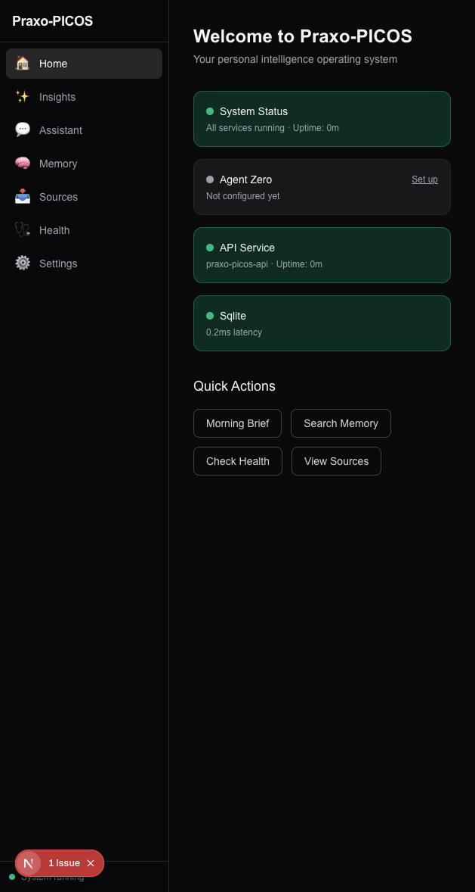
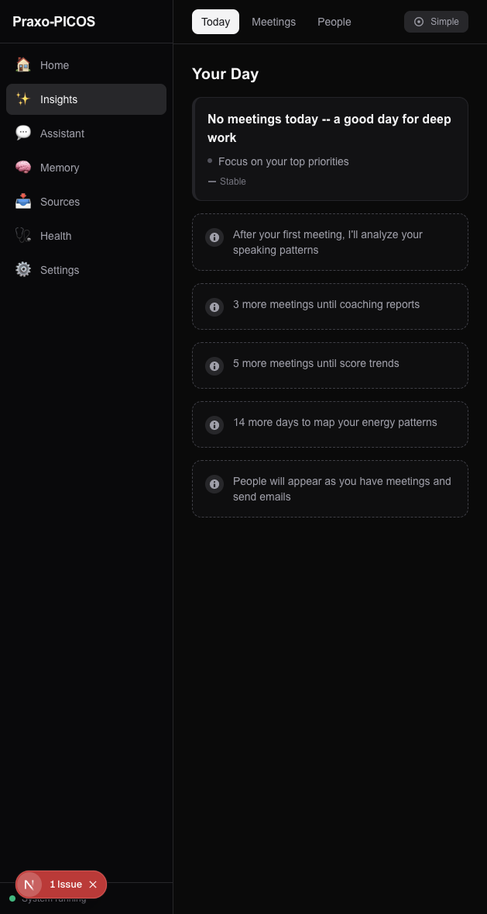
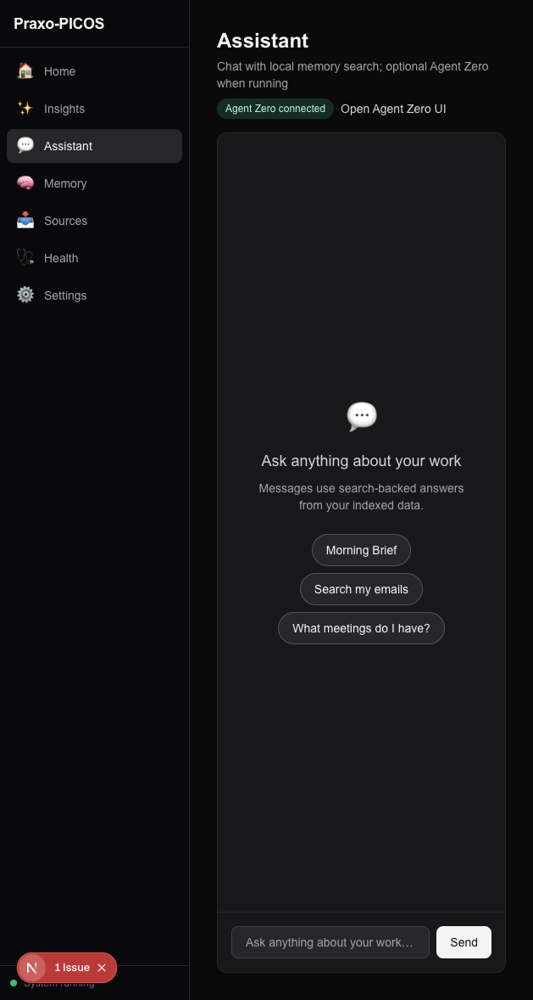
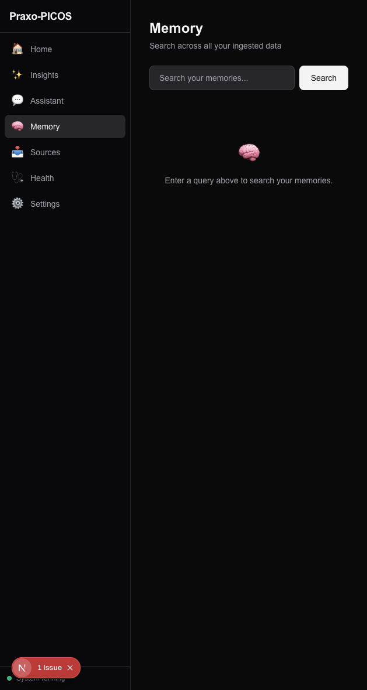
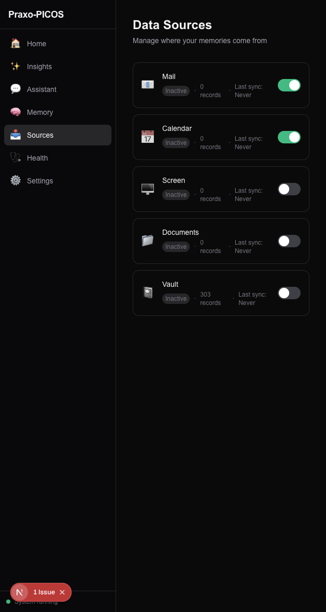
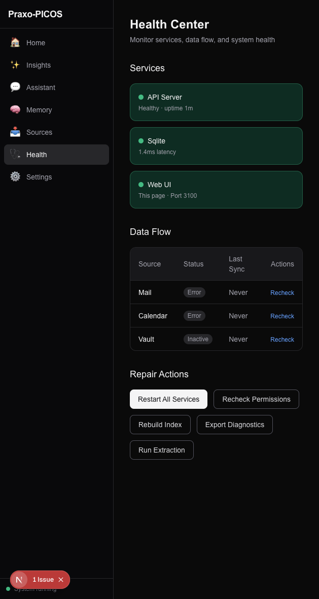
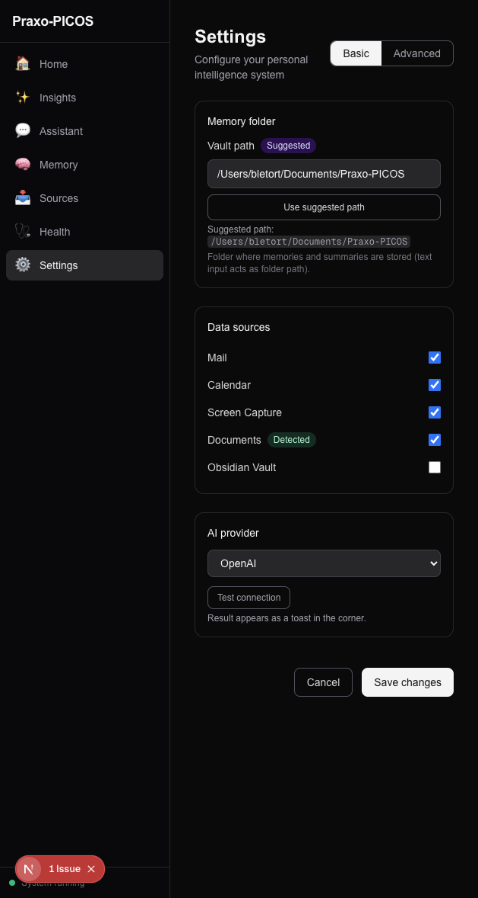

<p align="center">
  
</p>

<h1 align="center">Praxo-PICOS</h1>

<p align="center">
  <strong>Your AI learns how you work, how others respond, and what should happen next.</strong>
</p>

<p align="center">
  Personal Intelligence Compiler for macOS &mdash; captures context from email, calendar, screen activity, documents, and notes, then compiles it into executive intelligence. Everything runs locally. Your data never leaves your machine.
</p>

---

## The Problem

Most tools give you transcripts. Summaries. Note dumps. None of them tell you what actually happened.

- You make hundreds of decisions daily with fragmented context and no memory of what works
- You get meeting recaps but not whether the room actually agreed, who was unconvinced, or where your delivery lost clarity
- No tool learns your patterns, your relationships, or what makes you effective over time

## What PICOS Does

PICOS is not a note-taking app. It is an executive intelligence system built on four capabilities:

| | Capability | What it means |
|---|---|---|
| **1** | **Observe** | Captures everything -- screen, audio, calendar, mail, documents -- continuously and locally |
| **2** | **Understand** | Builds behavioral, relational, and operational models from raw signals |
| **3** | **Predict** | Anticipates needs, risks, stakeholder reactions, and optimal timing |
| **4** | **Intervene** | Coaches, prepares, drafts, sequences, and optimizes |

---

## Screenshots

<table>
  <tr>
    <td><br/><em>Home — system status at a glance</em></td>
    <td><br/><em>Insights — your day, meetings, people</em></td>
  </tr>
  <tr>
    <td><br/><em>Assistant — AI chat with memory search</em></td>
    <td><br/><em>Memory — search across all your data</em></td>
  </tr>
  <tr>
    <td><br/><em>Sources — manage your data feeds</em></td>
    <td><br/><em>Health Center — service monitoring</em></td>
  </tr>
  <tr>
    <td><br/><em>Settings — configure everything</em></td>
    <td></td>
  </tr>
</table>

---

## Intelligence Domains

PICOS implements ten intelligence domains that transform raw signals into actionable intelligence. These run automatically in the background -- no prompting required.

### Meeting Intelligence Beyond Transcription

Normal tools say: *"Discussed budget. Action item: follow up. Owner: Carol."*

PICOS tells you:

> Surface consensus reached on the budget proposal, but Bob appeared unconvinced (silent resistance probability: 0.35). Decision confidence was low on item 3. Carol needs follow-up -- her commitment language was vague. The room's energy dropped 40% during the technical section.

**Derived fields:** consensus confidence, decision ambiguity, commitment strength, meeting ROI, room energy curve, speaking equity, interruption asymmetry, meeting fatigue risk, hidden tension index, alignment decay risk.

### Executive Presence Coaching

> "You tend to accelerate pace and increase filler words when challenged by finance stakeholders."
>
> "Meetings after your fourth block of the day show lower patience and a higher interruption rate."
>
> "You lose audience engagement when answers exceed 90 seconds without anchoring to a business outcome."

**Derived fields:** executive presence score, clarity score, brevity efficiency, confidence stability, filler word density, talk-to-listen ratio, audience engagement curve, confidence leakage markers.

### Relationship Intelligence

> "Chris needs one private conversation before public alignment -- he says yes publicly but drags privately."
>
> "Your relationship with the infrastructure team is cooling. Last meaningful 1:1 was 23 days ago."

**Derived fields:** stakeholder alignment, trust trend, response reliability, follow-through probability, friction index, sponsorship potential, relationship decay velocity, preferred communication style.

### Predictive Stakeholder Strategy

> "If you lead with architecture, approval odds drop for this audience. Lead with business impact instead."
>
> "Socialize with finance before the steering committee. Socialization required score: 0.72."

**Derived fields:** approval likelihood, escalation risk, socialization required, objection probability by theme, ideal messenger, timing advantage, meeting readiness.

### Decision Quality Tracking

Automatically tracks what was decided, what assumptions were in play, what evidence existed, and what was ignored. Evaluates decisions over time.

**Derived fields:** decision quality score, assumption density, evidence strength, option diversity, bias markers, reversal probability, regret risk estimate.

### Personal Operating Optimization

> "Your best strategic thinking happens between 9-11am. Context switching costs you 23 minutes of recovery per switch. Today's cognitive load is elevated -- avoid hard decisions after 3pm."

**Derived fields:** cognitive load, context switch tax, decision fatigue, deep work probability, peak performance window, recovery need, stress carryover risk, calendar fragmentation, overload probability.

### Context Compilation

Before your meeting, PICOS assembles:

- **Stakeholder map** with predicted stances and approach recommendations
- **Objection forecast** with suggested responses
- **Risk-aware talking points** tailored to the audience
- **Context delta** since your last interaction with each attendee
- **Follow-up plan** with personalized messages per recipient

After the meeting: custom follow-ups -- one version for the executive, one for the technical team, one for the resistant stakeholder.

---

## Data Sources

Everything runs locally on your machine. No cloud services required.

| Source | What it captures |
|--------|-----------------|
| **Apple Mail** | Sender, recipients, subject, body, threads |
| **Apple Calendar** | Events, attendees, timing, location |
| **Screenpipe** | Screen OCR, audio transcription with speaker diarization, video frames for body language |
| **Documents** | File changes in your Documents folder |
| **Obsidian Vault** | Markdown notes from your vault |

The extraction pipeline runs every 15 minutes. The enrichment pipeline then promotes raw records into typed intelligence objects, runs LLM analysis, assembles meetings from calendar + screen data, resolves people across sources, and scores everything through the analytics stack.

---

## Context Compilation Theory

PICOS implements the reference architecture from [Context Compilation Theory](https://www.brianletort.ai/research/context-compilation-trilogy) -- the idea that context should not only be retrieved or remembered, but **compiled**: selected, transformed, governed, and lowered into executable context for models, agents, and interfaces.

```
Source → Substrate → Compiler → IR → Lowering → Runtime
```

| Layer | PICOS Implementation |
|-------|---------------------|
| Source | Mail, Calendar, Screenpipe, Documents, Vault |
| Substrate | ExtractedRecord in SQLite + FTS5 |
| Compiler | EnrichmentPipeline (3-stage: promote, enrich, analyze) |
| IR | MemoryObject with typed intelligence attrs |
| Lowering | Intelligence scorers (executive performance, relationship, meeting, operating optimization) |
| Runtime | MCP tools, AI chat, pre-briefs, follow-ups, daily briefs |

### Papers

- **Foundational:** [Toward a Theory of Context Compilation for Human-AI Systems](https://doi.org/10.5281/zenodo.19490060)
- **Paper 1:** [Context IR and Compiler Passes for Enterprise AI](https://doi.org/10.5281/zenodo.19546798)
- **Paper 2:** [Paged Context Memory](https://doi.org/10.5281/zenodo.19546800)
- **Paper 3:** [Quantized Context](https://doi.org/10.5281/zenodo.19546802)

See also: [Context Compilation Trilogy Hub](https://www.brianletort.ai/research/context-compilation-trilogy) and the [MemoryOS](https://github.com/Brianletort/MemoryOS) reference implementation.

---

## Architecture

| Service | Port | Description |
|---------|------|-------------|
| API server | 8865 | FastAPI backend with SQLite + FTS5 |
| Web dashboard | 3100 | Next.js dev server |
| Web runtime | 3777 | Next.js standalone (desktop app) |
| Qdrant | 6733 | Vector search (bundled binary) |
| MCP server | 8870 | 5 tools for AI assistant integration |

All data is stored at `~/Library/Application Support/Praxo-PICOS/`.

### Components

| Component | Technology |
|-----------|-----------|
| Backend | FastAPI, SQLAlchemy 2 async, SQLite + FTS5 |
| Frontend | Next.js 16, React 19, TypeScript, Tailwind 4 |
| Vector DB | Qdrant (bundled) |
| Intelligence | 10 analytics modules, 7 intelligence scorers, LLM enrichment |
| MCP | 5 tools: search_memory, get_daily_brief, list_sources, get_source_status, run_extraction |

---

## Quick Start

### One-line install:

```bash
curl -fsSL https://raw.githubusercontent.com/Brianletort/Praxo-PICOS/v0.3.4/scripts/install.sh | bash
```

### Launch:

```bash
picos
```

Then open **http://127.0.0.1:3100**. The onboarding wizard guides you through setup in under 2 minutes.

### Grant Full Disk Access (for email and calendar)

1. Open **System Settings > Privacy & Security > Full Disk Access**
2. Click **+** and add your terminal app
3. Restart `picos`

---

## Development

```bash
git clone https://github.com/Brianletort/Praxo-PICOS.git
cd Praxo-PICOS
make bootstrap
make dev-api    # Terminal 1: API on :8865
make dev-web    # Terminal 2: Web on :3100
```

### Testing

```bash
make test               # Unit + contract tests
make regression         # Full regression suite
cd apps/web && npm run e2e   # Playwright E2E tests
```

### Optional: Agent Zero

For a smarter AI assistant, install [Docker Desktop](https://www.docker.com/products/docker-desktop/) and enable Agent Zero in Settings.

---

## macOS Desktop App

The latest GitHub release includes `.dmg` and `.pkg` installers for Apple Silicon. They are unsigned, so macOS may quarantine them:

```bash
xattr -dr com.apple.quarantine "/Applications/Praxo-PICOS.app"
```

---

## Why This Gets Better Over Time

PICOS creates a compounding personal moat. The system learns:

- **Your rhythms** -- when you do your best thinking, when to avoid hard decisions
- **Your relationships** -- who responds to what, who follows through, who resists
- **Your winning styles** -- which framings land, which approaches persuade
- **Your failure signatures** -- where you hedge, where you rush, where patience drops

Every interaction makes the system more valuable. This is very hard to replicate with generic chat apps.

---

## License

Proprietary. All rights reserved.
