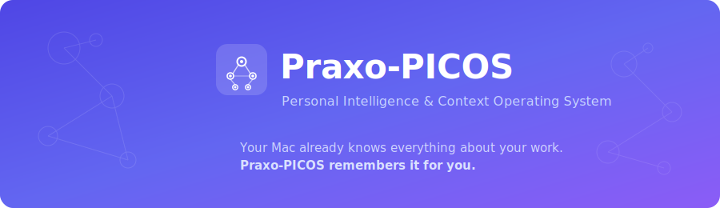
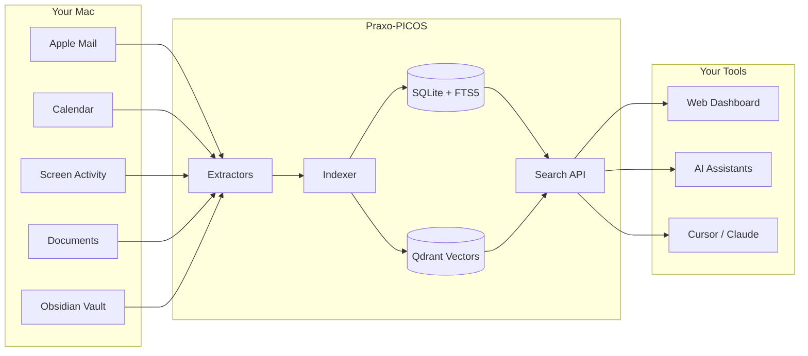
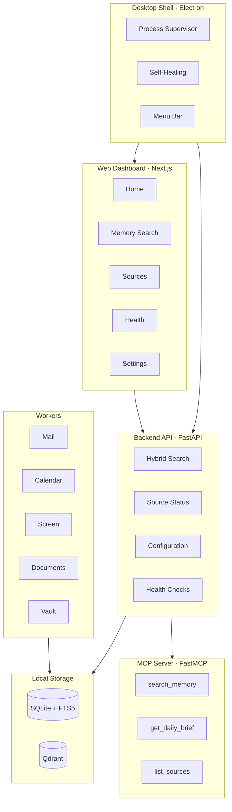

<p align="center">
  
</p>

<p align="center">
  <a href="https://github.com/praxo/picos/releases"></a>
  <a href="#"></a>
  <a href="#"></a>
  <a href="#"></a>
  <a href="#"></a>
</p>

---

## What is Praxo-PICOS?

**You context-switch dozens of times per day.** Every tab, email, meeting, and Slack thread adds a piece to the puzzle — and then it vanishes. By the time you need that context again, it's buried in an inbox, lost in a doc, or forgotten entirely.

**Praxo-PICOS is your second brain.** It's a local-first personal intelligence system that quietly captures context from your Mac's native data sources — email, calendar, screen activity, documents, and notes — then organizes everything into a searchable, AI-queryable memory. Think of it as a photographic memory for your entire work life.

**Context is king. Tools change; your data does not.** PICOS stores everything locally in SQLite and Qdrant. No cloud syncing. No subscriptions. No data leaving your machine. The tools on top — dashboards, AI assistants, MCP integrations — can evolve freely because the context layer underneath is permanent and portable.

---

## How It Works

Your Mac already generates a rich stream of work context every day. PICOS captures it, indexes it, and makes it available through a dashboard and AI tools.



**In plain English:**
1. **Extractors** read your local data sources (read-only — PICOS never modifies your files)
2. **The Indexer** chunks and indexes everything for fast keyword and semantic search
3. **The API** serves your dashboard, AI assistants, and any tool that speaks MCP

---

## Quick Start

### Download the App (Recommended)

The fastest way to get started:

1. **Download** the latest `.dmg` from [GitHub Releases](https://github.com/praxo/picos/releases)
2. **Install** — drag Praxo-PICOS to your Applications folder and open it
3. **Set up** — the onboarding wizard walks you through choosing your data sources

That's it. PICOS runs in your menu bar and keeps your memory up to date in the background.

<details>
<summary><strong>Run from source (for developers)</strong></summary>

<br/>

**Prerequisites:** Python 3.11+, Node.js 20+, Docker (for Qdrant)

```bash
# 1. Clone and bootstrap
git clone https://github.com/praxo/picos.git
cd picos
make bootstrap          # Creates Python venv + installs Node deps

# 2. Start Qdrant (vector database)
docker compose -f infra/docker/docker-compose.yml up -d

# 3. Start the backend API
make dev-api            # Runs on http://localhost:8865

# 4. Start the web dashboard
make dev-web            # Runs on http://localhost:3100
```

Open [http://localhost:3100](http://localhost:3100) in your browser. The onboarding wizard will guide you from there.

</details>

---

## What Can You Do With It?

PICOS turns your scattered work context into an instantly searchable, AI-queryable memory. Here are real examples:

| | Use Case | Example Query |
|---|---|---|
| **Morning Brief** | Start your day with a summary of what happened overnight | *"What happened yesterday across all my projects?"* |
| **Deep Search** | Find anything you've seen, read, or written | *"Find that email thread from March about the API redesign"* |
| **Meeting Prep** | Walk into every meeting with full context | *"What context do I need for my 2pm with Sarah?"* |
| **Project Recall** | Reconstruct decisions and timelines from months ago | *"What decisions were made on Project Atlas last quarter?"* |
| **Agent Integration** | Let AI assistants search your memory via MCP | *"Claude, search my memories for budget discussions"* |

---

## Data Sources

PICOS connects to native macOS data sources. All access is **read-only** — PICOS never modifies, deletes, or sends your data anywhere.

| Source | What It Reads | Default |
|---|---|---|
| **Apple Mail** | Local SQLite index of your email (subject, sender, body) | Enabled |
| **Calendar** | macOS Calendar database (events, attendees, times) | Enabled |
| **Screen Activity** | What's on your screen via [Screenpipe](https://github.com/mediar-ai/screenpipe) | Opt-in |
| **Documents** | Text files in your Documents folder (`.md`, `.txt`, `.csv`, `.json`, `.yaml`) | Opt-in |
| **Obsidian Vault** | Markdown notes from your Obsidian vault | Opt-in |

> **Privacy guarantee:** Your data never leaves your machine. PICOS runs entirely on localhost. There are no analytics, no telemetry, no cloud sync. Period.

---

## Architecture

PICOS is a monorepo with four main components that run as local services on your Mac:



| Directory | What Lives Here |
|---|---|
| `apps/desktop` | Electron shell — process supervisor, self-healing, menu bar icon |
| `apps/web` | Next.js 16 dashboard with React 19 and Tailwind CSS |
| `services/api` | FastAPI backend — search, sources, config, health endpoints |
| `services/workers` | Extractors for each data source + indexing pipeline |
| `packages/shared` | Runtime contracts and shared constants |
| `infra/docker` | Docker Compose for Qdrant vector database |
| `packaging/` | macOS code signing, notarization, and release scripts |

---

## MCP Tools

PICOS exposes an [MCP](https://modelcontextprotocol.io/) server so AI assistants (Claude, Cursor, Agent Zero, or any MCP client) can query your memory programmatically.

| Tool | What It Does |
|---|---|
| `search_memory` | Hybrid keyword + semantic search across all your indexed context |
| `get_daily_brief` | Generate a summary of all activity for a given date |
| `list_sources` | List all configured data sources and their current status |
| `get_source_status` | Detailed health and record count for a specific source |
| `health_check` | Check the health of all PICOS services |

**Connect to your AI assistant:**

```json
{
  "mcpServers": {
    "praxo-picos": {
      "url": "http://localhost:8870/sse"
    }
  }
}
```

---

## Why Local?

PICOS is designed around a simple conviction: **your work context is too valuable to live anywhere but your own machine.**

- **No cloud, no risk.** Your emails, calendar, screen activity, and documents stay on your Mac. Nothing is ever uploaded, synced, or shared.
- **No API keys required.** Core functionality (extraction, indexing, search) works without any external services. AI features are optional and use your own API keys.
- **Tools are swappable; context is permanent.** Dashboards, AI models, and integrations will evolve. Your indexed memory is stored in open formats (SQLite, Qdrant) that you control forever.
- **Built for macOS power users** who live in email, documents, terminals, and code — and want total recall without giving up privacy.

---

<details>
<summary><strong>Developer Reference</strong></summary>

### Local Ports

| Service | Port |
|---|---|
| Backend API | `8865` |
| Web Dashboard (dev) | `3100` |
| Web Dashboard (packaged) | `3777` |
| MCP Server | `8870` |
| Qdrant HTTP | `6733` |
| Qdrant gRPC | `6734` |

### Make Targets

```bash
make bootstrap          # Python venv + Node deps
make dev-api            # Start API on :8865
make dev-web            # Start dashboard on :3100
make test               # Unit + contract tests
make lint               # Ruff (Python) + ESLint (TypeScript)
make typecheck          # mypy + tsc
make regression         # Full regression suite
make regression-fast    # Fast subset for PRs
```

### Test Suite

- **108+ Python tests** — unit, contract, regression, performance, data quality
- **8 Vitest tests** — component and integration
- **21 Node tests** — supervisor, self-healing, Docker manager
- **5 CI workflows** — fast, e2e, nightly, regression-pr, regression-nightly

### Release

```bash
git tag v0.1.0 && git push origin v0.1.0
```

This triggers the `macos-release` workflow for code signing and notarization. See [`docs/runbooks/release.md`](docs/runbooks/release.md) for details.

### Repo Layout

```
praxo-picos/
├── apps/
│   ├── desktop/        # Electron shell
│   └── web/            # Next.js dashboard
├── services/
│   ├── api/            # FastAPI backend
│   └── workers/        # Extractors + indexing
├── packages/shared/    # Runtime contracts
├── infra/docker/       # Qdrant compose
├── packaging/          # macOS signing scripts
├── docs/               # Standards + runbooks
└── tests/              # Full test suite
```

</details>

---

## Contributing

We welcome contributions. See [CONTRIBUTING.md](CONTRIBUTING.md) for guidelines.

## License

MIT
